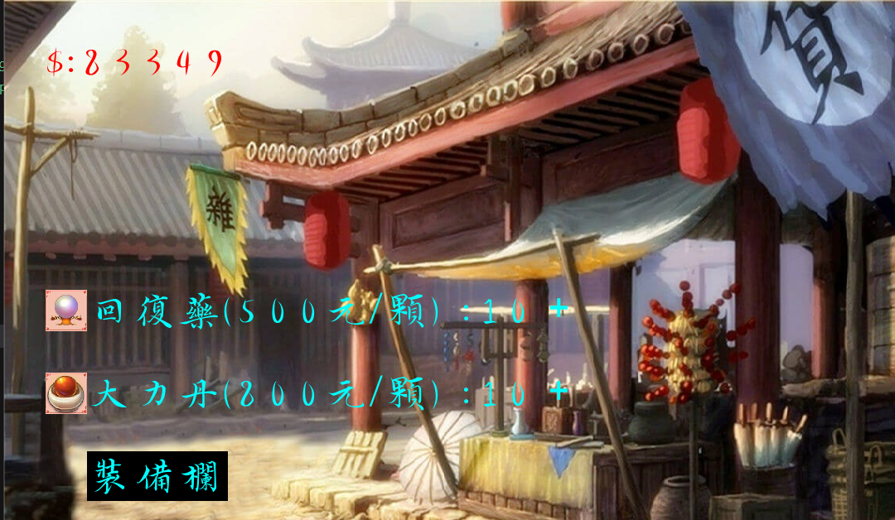

# Jiang-Hu
A wuxia game based on Allegro 5 in c++. This game is built in code block project.

**The file size is too large, so I put the source code on my [Google Drive](https://drive.google.com/file/d/1i4TlA650Ws9Di4hj4qlMJHxvwzt3kgEj/view?usp=sharing)**

It is a complete game with different features like:

- Login system
- Character selection
- Different levels
- Different enemies
- Different equipments
- Money system
- Shop system
- Lottery system
- Welcome screen & Animation
- Game over screen
- A variety of Achievements

### Welcome Animation
You could skip the animation by clicking the mouse. The animation is shown below:


After the animation, you will be directed to the welcome screen and comes the login system.

### Login system
After clicking the mouse, you will be directed to the login screen. You could login with the username and password. If you don't have an account, you could click the register button to register a new account.

**However, no one has successfully pressed the login button yet.**


The default account is:

You could change the account and password in 16 and 17 th line of the `game_login.cpp` file.

```
string ACCOUNT = { "KnuckleKing" };
string PASSWORD = {"GuardTheWall"};
```

### Character selection
After logging in, you will be directed to the character selection screen. You could choose the character you like.


### Lobby
After choosing the character, you will be directed to the lobby. In here, you could choose to enter the game, the ranking, the shop, check the achievements, or learn how to control the game.


### Game

The following are some quick screenshots of the game:

- The Rankings (英雄榜):

In here, we record the top ten players with the highest scores. Pressing ENTER will go on to the next page (level 2) and BACKSPACE will go back to the lobby.


- The Shop (靈丹閣):

In the shop, you could buy two items:

1. The health potion (回復藥): It will increase your health by 100 points.
2. The attack potion (大力丹): It will double your attack.



In the shop, you could enter the equipment system, where you could equip items and draw items, by clicking the "裝備欄" button.


In here, pressing down the middle of the BAGUA will draw a random item. The item will be shown in the "背包" section. You could equip the item by clicking the "裝備" button.


Putting on the equipment will increase different abilities. And be careful that some might decrease your abilities.

By hovering your mouse on the item in the "背包" section, you could see the details of the item. And by clicking on the equipment, you could equip the item. Clicking on the equiped item will unequip the item.


Pressing the "靈丹閣" button will go back to the shop.

### Achievements (成就榜)

In the achievements section, you could see the achievements you have achieved. There are 15 achievements in total. You could move on to the next page by pressing ENTER and go back to the lobby by pressing BACKSPACE.


### Battle

In the game, you and the computer will fight against each other. You could move your character by pressing ASWD and attack by pressing arrow keys. The computer will attack you randomly. You could see the health of both characters on the top of the screen.

Stage 1:


Stage 2:


In stage 2, both you and the computer will have an extra firearm. You could press the ENTER key to use the firearm. Your firearm has a cooldown time of 10 seconds. Meanwhile, the computer's firearm has a cooldown time of 8 seconds.

You will see the ready sign on the left-bottom corner of the screen when the firearm is ready.


If you won the geme, you would see the following screen:


If you lose the game, you would see the following screen:

